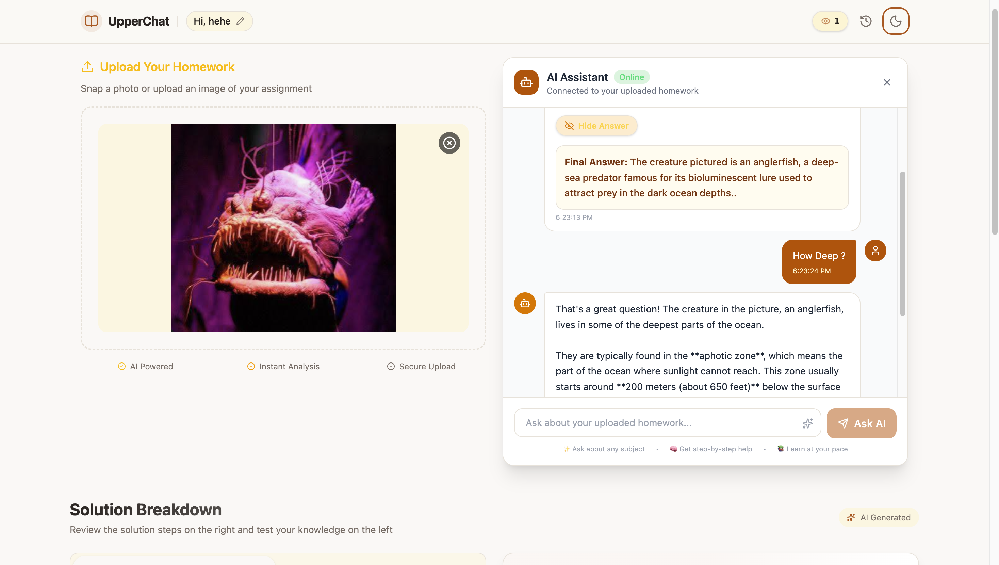

# UpperChat



UpperChat is an AI-powered homework assistant built with Next.js, React, Tailwind CSS, Supabase, and the Google Gemini API. It allows users to upload images of their homework, analyze them, and chat with an AI tutor for step-by-step guidance.

## Features

- Image Upload & Scanning: Upload images of homework assignments.
- AI Analysis: Utilizes Google's Gemini API to analyze homework questions and provide detailed explanations.
- Interactive Chat: Chat with the AI tutor for further clarification on specific problems.
- Supabase Integration: Securely stores uploaded homework scans in Supabase Storage.
- API Key Rotation: Supports multiple Gemini API keys to handle rate limiting and high traffic.

## Prerequisites

Before you begin, ensure you have the following installed:
- Node.js (v18 or higher recommended)
- npm, yarn, pnpm, or bun

You will also need accounts for:
- [Supabase](https://supabase.com) (for storage and database)
- [Google AI Studio](https://aistudio.google.com/) (for Gemini API keys)

## Getting Started

Follow these steps to set up the project locally.

### 1. Clone the repository

```bash
git clone https://github.com/WilWilbert123/StudentHelp.git
cd StudentHelp
```

### 2. Install dependencies

```bash
npm install
```

### 3. Set up Supabase

1. Create a new project in Supabase.
2. Go to Project Settings -> API to find your Project URL, Anon Key, and Service Role Key.
3. Go to Storage and create a new bucket. By default, the app looks for a bucket named `homework-scans`. Make sure to set the bucket to Public so images can be displayed.

### 4. Set up Gemini API

1. Go to Google AI Studio and create an API key.
2. (Optional) You can create up to 5 API keys if you expect high traffic, as the application supports rotating keys to avoid rate limits.

### 5. Configure Environment Variables

Create a `.env.local` file in the root directory of the project and add the following variables:

```env
# Supabase Configuration
NEXT_PUBLIC_SUPABASE_URL=your_supabase_project_url
NEXT_PUBLIC_SUPABASE_ANON_KEY=your_supabase_anon_key
SUPABASE_SERVICE_ROLE_KEY=your_supabase_service_role_key
NEXT_PUBLIC_SUPABASE_BUCKET=homework-scans

# Gemini API Configuration
# You must provide at least one key. Additional keys are used for rotation.
GEMINI_API_KEY=your_primary_gemini_api_key
GEMINI_API_KEY_2=your_second_gemini_api_key
GEMINI_API_KEY_3=your_third_gemini_api_key
GEMINI_API_KEY_4=your_fourth_gemini_api_key
GEMINI_API_KEY_5=your_fifth_gemini_api_key
```

### 6. Run the Development Server

Start the development server:

```bash
npm run dev
```

Open [http://localhost:3000](http://localhost:3000) with your browser to see the result.

## Tech Stack

- Framework: Next.js (App Router)
- Language: TypeScript
- Styling: Tailwind CSS
- Backend/Storage: Supabase
- AI/LLM: Google Gemini API
- Icons: Lucide React
- Animations: Framer Motion

## Learn More

To learn more about the technologies used in this project, take a look at the following resources:
- [Next.js Documentation](https://nextjs.org/docs)
- [Supabase Documentation](https://supabase.com/docs)
- [Google Gemini API Documentation](https://ai.google.dev/docs)
- [Tailwind CSS Documentation](https://tailwindcss.com/docs)

## Deployment

The easiest way to deploy your Next.js app is to use the [Vercel Platform](https://vercel.com/new). Check out the [Next.js deployment documentation](https://nextjs.org/docs/app/building-your-application/deploying) for more details. Ensure that you configure all the environment variables mentioned above in your deployment platform's dashboard.
